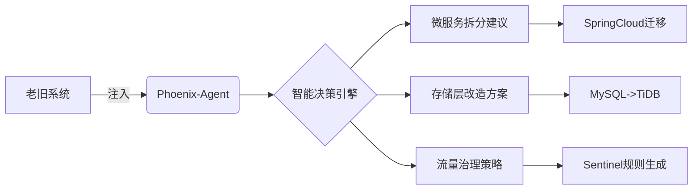

**Phoenix-Framework（凤凰架构演进框架）**
**定位**：面向存量系统架构改造的智能决策中间件



#### 模块1：架构健康度诊断
```java
// 通过字节码分析识别架构坏味道
public class ArchitectureScanner {
  @Diagnose(rule = "GodClass")
  public void detect(ClassNode clazz) {
    if(clazz.methods.size() > 20) {
      report.add(new Smell("GodClass", clazz.name));
    }
  }
}
```

#### 模块2：改造策略生成器
| 问题类型       | 改造策略                      | 技术组合                   |
|----------------|-----------------------------|--------------------------|
| 单体数据库瓶颈 | 分库分表方案                | ShardingSphere+Zookeeper |
| 服务耦合严重   | DDD边界划分建议             | EventStorming可视化       |
| 接口性能低下   | 缓存策略+协议优化           | Protobuf+RedisBloom       |

#### 模块3：灰度迁移沙箱
```python
# 流量镜像对比测试（伪代码）
def traffic_mirror(old, new):
    with ThreadPoolExecutor() as executor:
        future_old = executor.submit(old.process, request)
        future_new = executor.submit(new.process, request)
        return compare(
            future_old.result(), 
            future_new.result()
        )
```


1. **架构决策树**：
   ```mermaid
   graph TD
   A[QPS>10w?] -->|是| B[考虑服务网格]
   A -->|否| C[SpringCloud足够]
   B --> D[Istio vs Linkerd]
   ```

2. **专利级算法**：
   - 基于拓扑排序的服务依赖分析
   - 遗传算法优化的分库分表方案
   - 时序预测的弹性扩缩容模型

3. **可视化报告**：
   ```bash
   # 生成的架构改造报告示例
   [严重级别] 数据库耦合度 0.92（>0.7需紧急处理）
   [建议方案] 垂直分库+事件溯源模式
   [预估收益] 吞吐量提升300% | 延迟降低60%
   ```

